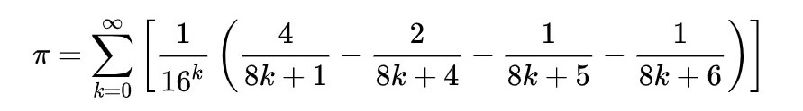

## Bailey–Borwein–Plouffe formula

Among all the algorithms possible for calculating pi such as Chudnovsky algorithm, Leibniz’s formula and etc. The BBP was mostly recommended because 
1-it calculates the digits of pi with a high accuracy and also 
2-it takes a short amount of time for calculation and the reason is that in this algorithm we are working with basic data types that consume little memory.

  

The Bailey–Borwein–Plouffe formula (BBP formula) is a formula for π. It was discovered in 1995 by Simon Plouffe.The BBP formula gives rise to a spigot algorithm for computing the nth base-16 (hexadecimal) digit of π (and therefore also the 4nth binary digit of π) without computing the preceding digits. 

https://en.wikipedia.org/wiki/Bailey%E2%80%93Borwein%E2%80%93Plouffe_formula
https://www.researchgate.net/publication/228702113_The_BBP_Algorithm_for_Pi
## A problem that I encountered

I received an error while I was importing TimeUnit as a result I wasn't able to use TimeUnit.MILLISECONDS for awaitTermination of threadpool.I found a piece of code that did the same thng and used it as an alternative.
